<div align="center">
<br/>

  <h1 align="center">
    Layui Vue Admin
  </h1>

  <h4 align="center">
     开 箱 即 用 的 layui vue 企 业 级 前 端 模 板
  </h4> 

  [官 网](http://www.layui-vue.com/) |   [预 览](http://admin.layui-vue.com/) 

</div>

<p align="center">
    <a href="#">
        
    </a>
    <a href="#">
        
    </a>
    <a href="#">
        
    </a>
    <a href="#">
        
    </a>
</p>

<div align="center">
  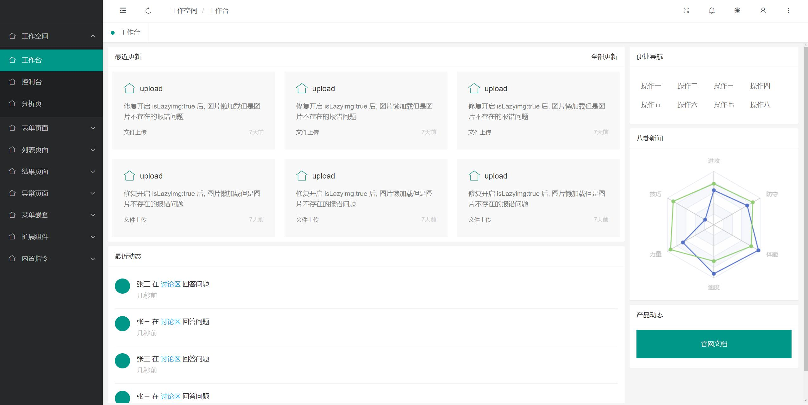
</div>


### 🌈 项目概述

* 基于 Layui Vue 实现的通用前端模板。整合最新技术高效快速开发，前后端分离模式，开箱即用。
* 核心模块包括：登录、工作空间、表单页面、列表页面、结果页面、异常页面 等功能。
* 代码量少、学习简单、功能强大、轻量级、易扩展，轻松开发从现在开始！

### 开始使用

```

切换环境

nvm install 16.0.0

nvm use 16.0.0

安装依赖

npm install -g pnpm

pnpm install

启动项目

npm run dev

打包项目

npm run build

```

## 预览截图

| 预览                 |                界面 |
|---------------------|---------------------|
|  | 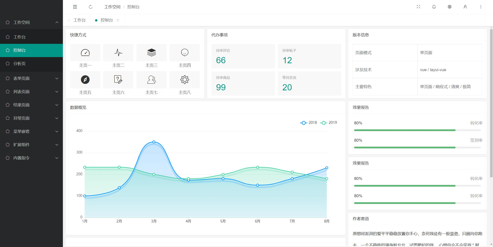 |
| 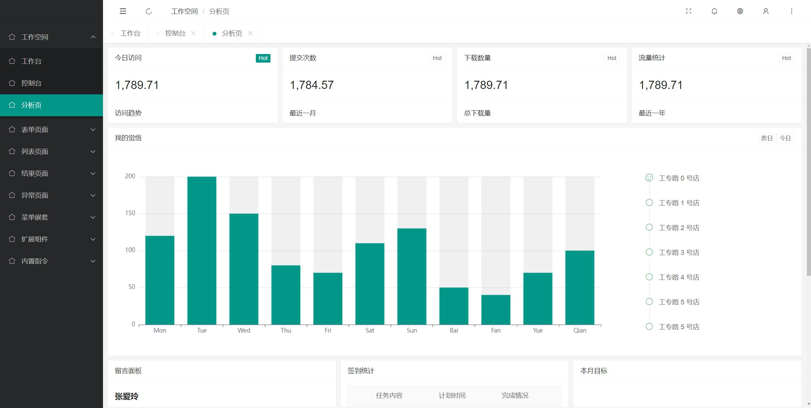 | 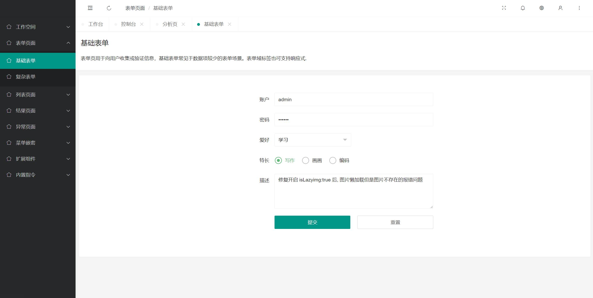 |
| 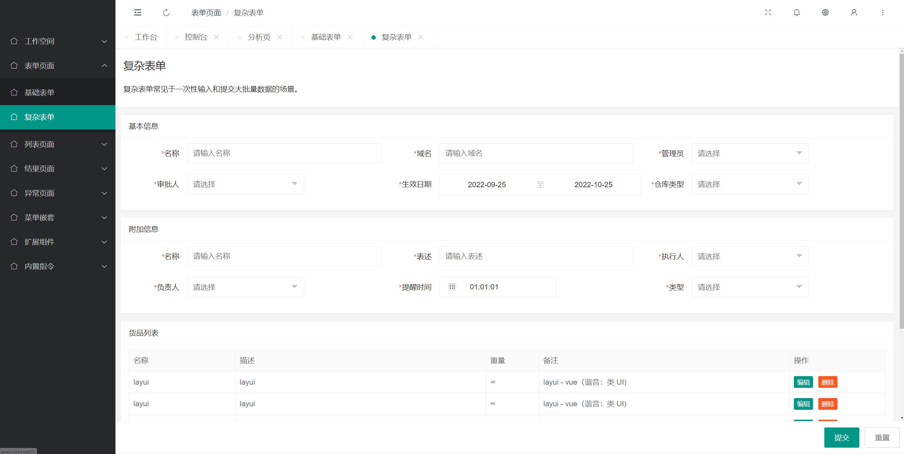 | 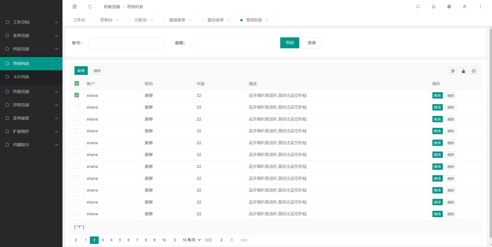 |
| 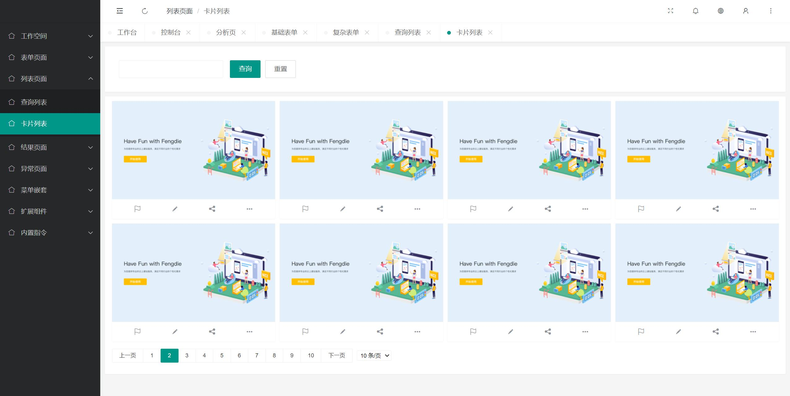 | 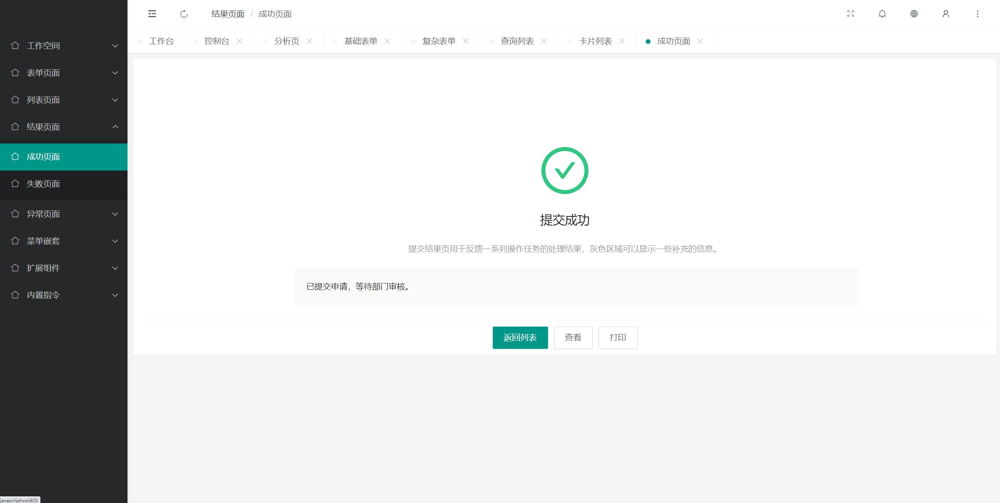 |
| 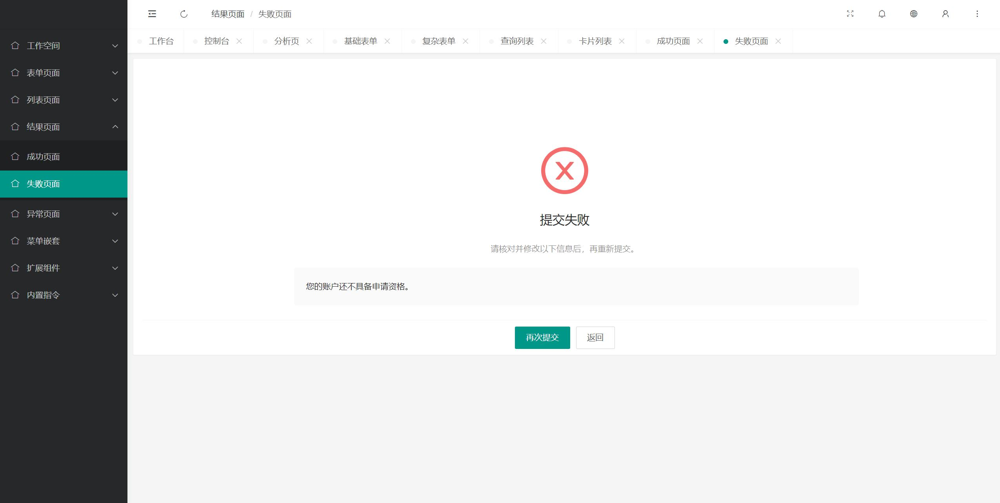 | 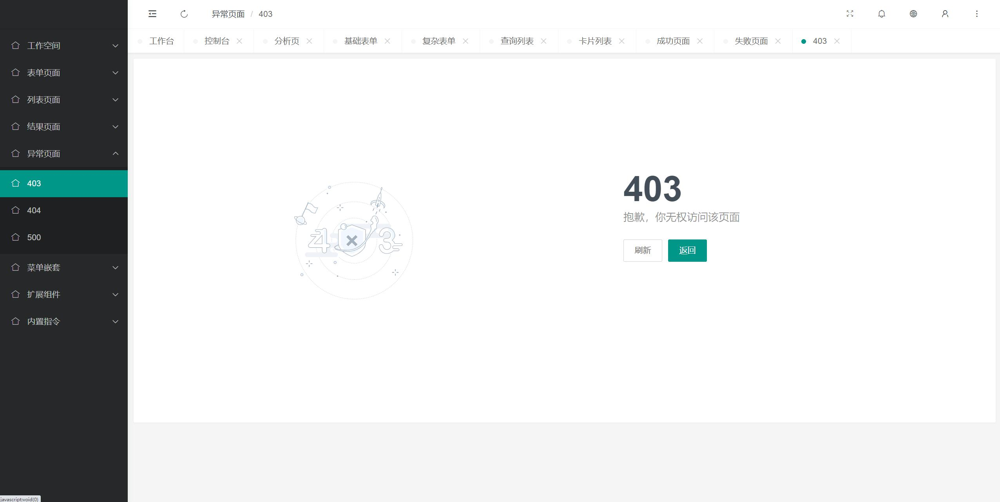 |
| 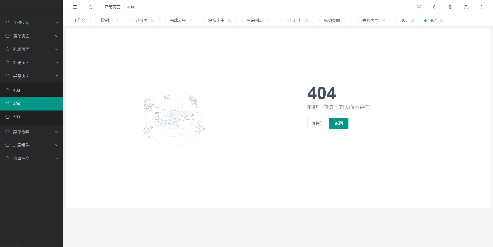 | 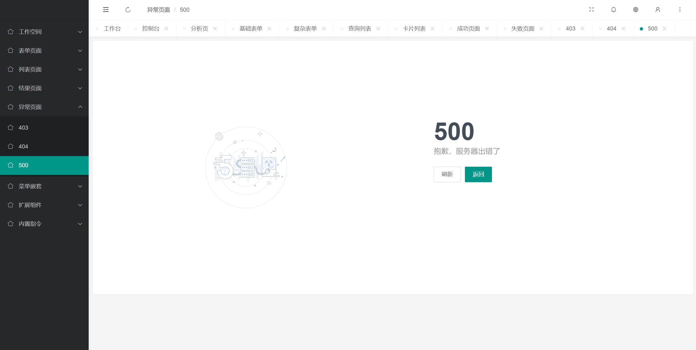 |
|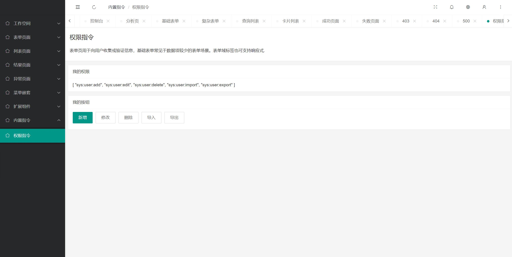 | 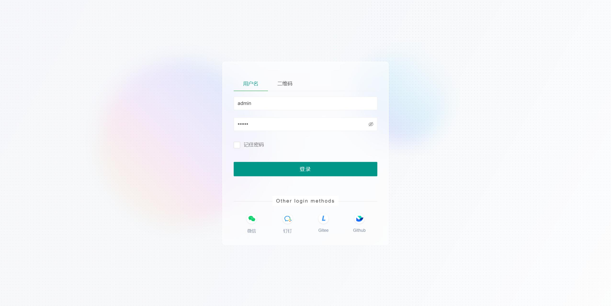 |